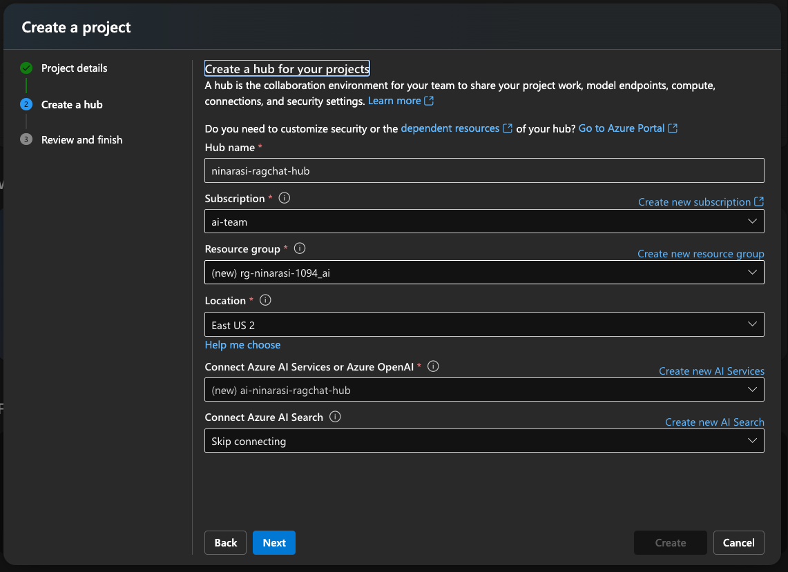
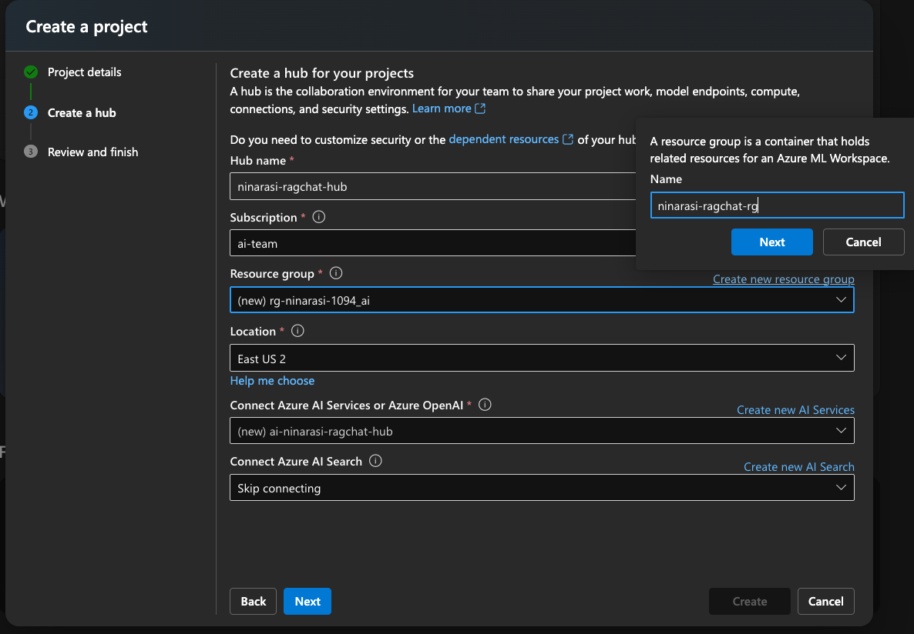
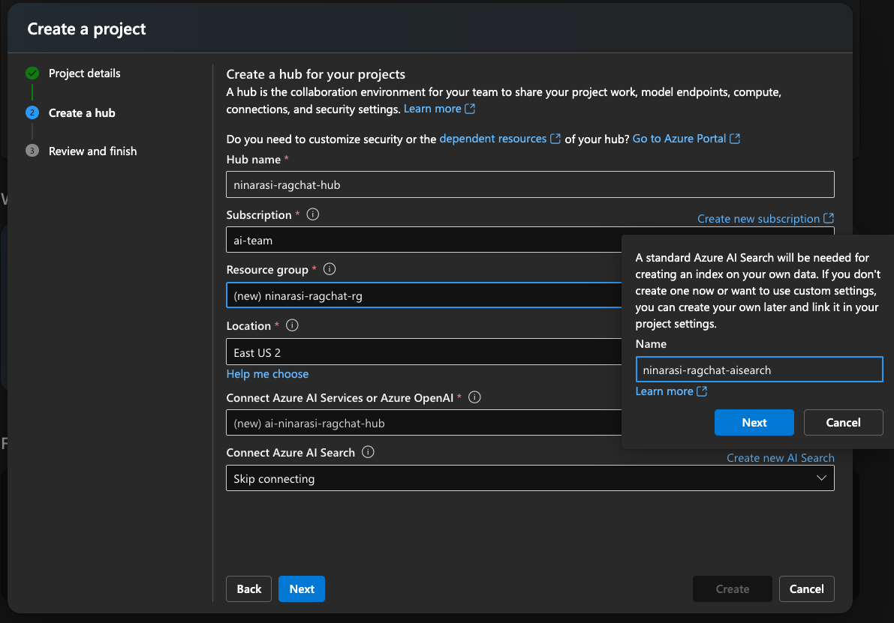
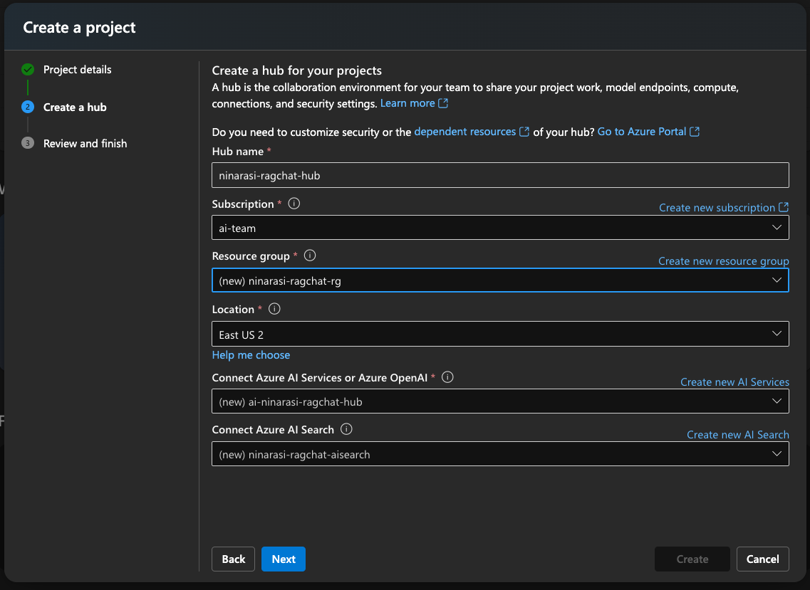
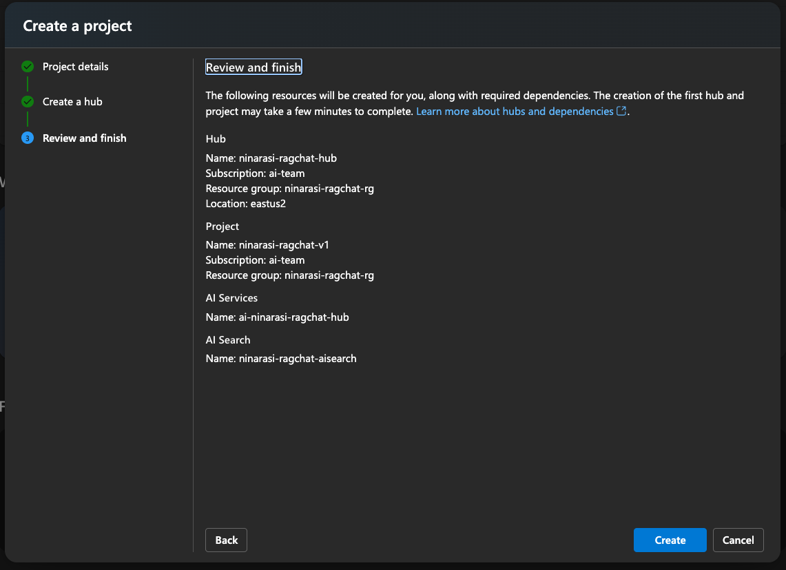
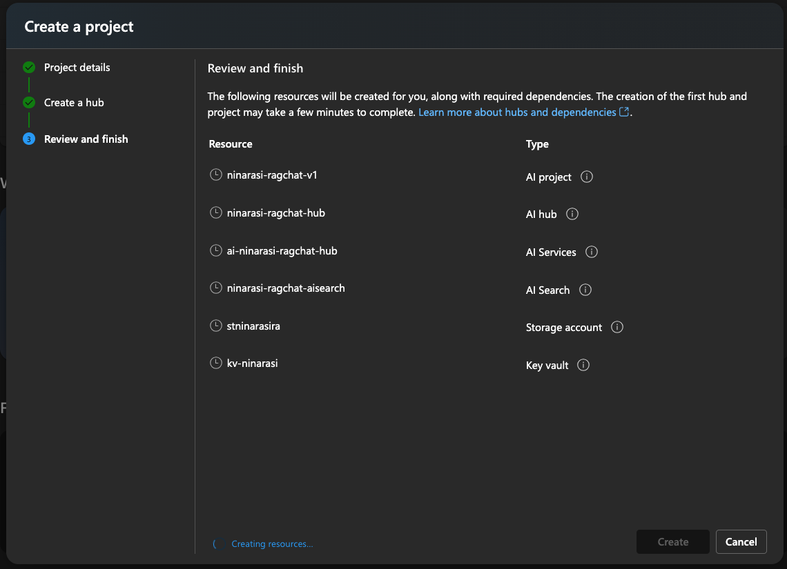
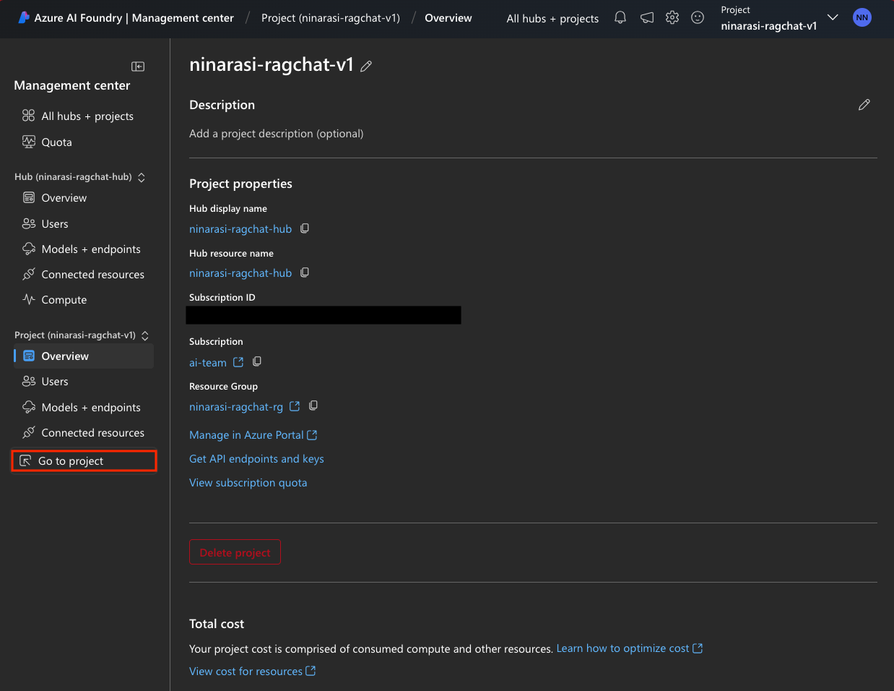
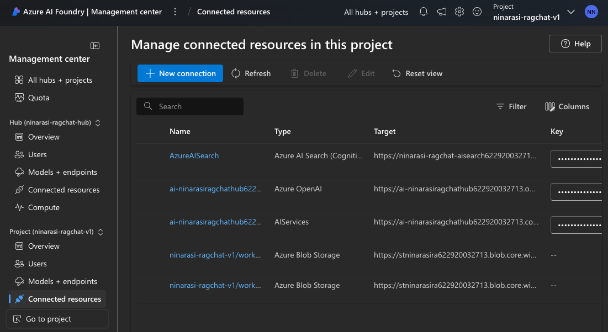

# 2.1 [Create AI Project](https://learn.microsoft.com/en-us/azure/ai-studio/tutorials/copilot-sdk-create-resources?tabs=macos#create-a-project)

!!! info "This is [Part 1](https://learn.microsoft.com/azure/ai-studio/tutorials/copilot-sdk-create-resources) of the tutorial. **This stage is completed USING THE AZURE AI FOUNDRY PORTAL**"

    At the end of this section, you should have provisioned an Azure AI Hub and Azure AI project resource, setup an Azure AI Search resource and deployed two Azure OpenAI models for implementing the RAG-based copilot. You should also have launched GitHub Codespaces and configured your development environment to work with your provisioned Azure infrastructure.

---

## 1. Log Into Azure AI Foundry

1. Open a private browser and navigate to [https://ai.azure.com](https://ai.azure.com).
1. Log in with an active Azure subscription. Note the tenant ID if multi-tenant.
1. You should see a landing page with a blue "+ Create project" button as shown below. 
    

Note: If you had previously created projects, those will be listed as shown above. Don't worry if you don't see any listed for your profile. We are going to create a new project next.

---

## 2. Create a new project

1. Click the "+ Create project" button. _You should see a dialog popup like this._ Your default project name and hub information will be different and reflect your prior activity.
    

1. Change the default project name to something memorable - I used `ninarasi-ragchat-v1`.
1. We also want to create a new hub for our new AI project - let's fix that next in the dialog.

---

## 3. Create new hub

1. Click the `Create new hub` (blue lettering) in dialog above.
1. Pick a memorable name that reflects the project - I used `ninarasi-ragchat-hub`
    
1. Click "Next". It returns you to the previous dialog, with an enhanced view as shown
    

---

## 4. Customize the hub

1. Click the "Customize" button in that dialog. This lets you customize the defaults as shown.
1. First, select a relevant **Location** with relevant model quota - I used `East US2`
    
1. Next,customize the resource group name to be memorable - I used `ninarasi-ragchat-rg`
    
1. Next, click "Create new AI Search" (blue lettering) in the dialog to trigger a new pop-up

---

## 5. Create new AI Search

1. Customize resource name - I used `ninarasi-ragchat-aisearch` - then hit **Next**.
    
1. You return to the **Create a project** wizard - hit **Next** to get to review.
    
1. Review the details one last time - hit **Create** to confirm AI project creation.
    
1. Creation takes a few minutes - all elements will show green on success.
    

---

## 6. Review Created AI Project

1. You should automatically be taken to the AI Project overview page as shown. Note the **Project connection string** under `Project details` - we'll revisit it later.
    
1.  Click on the **Open in management center** link (highlighted in red) - it takes you to this Management Center view. Clicking `Go to project` will take you back to the AI project.
    
1. However, for now click on the **Connected Resources** option in the sidebar. This lets us see which resources can be accessed via the _Project connection_ we noted earlier. Verify that Azure AI Search is one of the listed resources.
    

---

!!! success "CONGRATULATIONS! You created your Azure AI Hub & Project resources"

