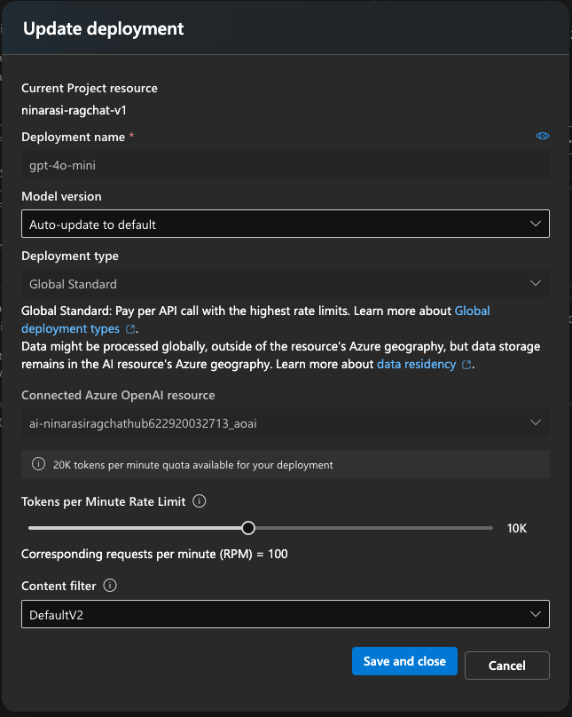

# 4.3 Configure Evaluation Model

Recall that in the last section, the evaluation script identified an _evaluator_model_ that will serve as the judge AI for this assessment. 

---

## 1. Specifying Evaluator Model

In this workshop, we are reusing the same model for both _chat_completion_ and _evaluation_ roles, but you can choose to separate the two by:

- Deploying a new model to the same Azure AI Project
- Updating the `EVALUATION_MODEL` environment variable to this one
- Restarting the evaluation script

!!! task "HOMEWORK: Try deploying a `gpt-4` model for evaluations. How do results differ?"

```python title="src/api/evaluate.py"

    # ----------------------------------------------
    # 2. Define Evaluator Model to use
    # ----------------------------------------------
    evaluator_model = {
        "azure_endpoint": connection.endpoint_url,
        "azure_deployment": os.environ["EVALUATION_MODEL"],
        "api_version": "2024-06-01",
        "api_key": connection.key,
    }

    groundedness = GroundednessEvaluator(evaluator_model)
```

---

## 2. Configuring Evaluator Model

Let's take a look at the core `evaluate` function that executes the workflow. This function will run an assessment once for each record (in `data`), for each evaluator (in `evaluators`). This requires a lot of calls to the identified evaluation model - **which will require a higher token capacity for efficient completion**.

Note: The current script uses a single evaluator (for Groundedness). Adding additional evaluators will increase the number of calls made to the default model, so make sure you configure quota to adjust for that accordingly.=

!!! tip "Update the model quota in Azure AI Foundry if execution has rate limit issues"

    Take these steps to view and update your model quota.

    - Visit your Azure AI project page in Azure AI Foundry
    - Click "Models + Endpoints" and select the evaluation model
    - Click `Edit` and increase the *Tokens per minute rate limit** (e.g., to 30)
    - Click `Save and close` 

??? info "Click to expand and see a screenshot of the update dialog"

    