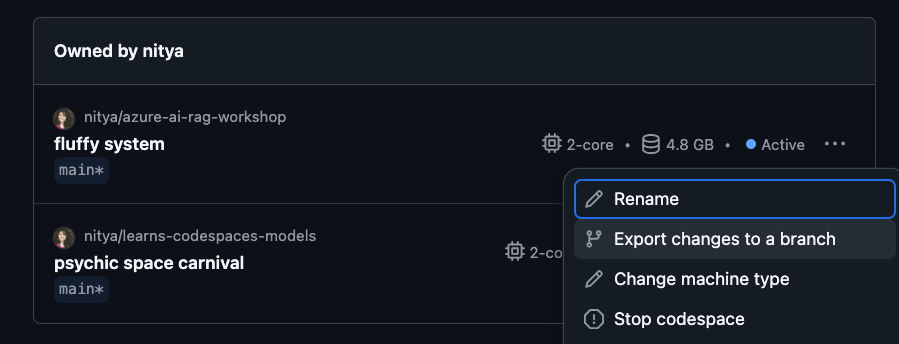
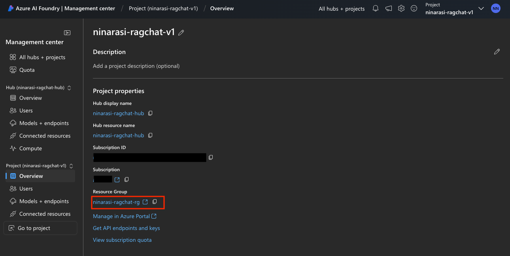

# 6. Cleanup 🚨

!!! danger "We deployed AI models and an AI search resource. We used GitHub Codespaces for development. These can incur unnecessary costs or quota usage if left running. LET'S CLEAN THIS UP NEXT!"

## 1. Delete GitHub Codespaces

Github Codespaces has a [free tier](https://docs.github.com/en/billing/managing-billing-for-your-products/managing-billing-for-github-codespaces/about-billing-for-github-codespaces#monthly-included-storage-and-core-hours-for-personal-accounts) for personal accounts with 15GB storage and 120 Core hours _per month_. This quota is more than sufficient for running this workshop, but leaving the Codespaces running  will use up that quota unnecessarily.

**Let's delete the active codespaces**.

1. Visit [Your Codespaces](https://github.com/codespaces) page on GitHub.
1. Scroll to see the **Owned by [username]** section. For example: the screenshot shows the section `Owned by nitya` listing my codespaces.
1. Identify the GitHub Codespaces instance used for this workshop by checking the repo name shown above the codespaces name. For example: the screenshot shows `nitya/azure-ai-rag-workshop` as the repo for the `fluffy system` codespace.

---

The codespace may show unsaved changes (see: `main*` under codespaces name, where the `*` indicates you have unsaved changes on the main branch). _You can commit these changes to save your workshop progress, or you can ignore them to retain the original workshop_. 

**Let's delete the codespace.** Click the `...` icon to get the drop-down menu as shown below. You now have the option to **Stop codespace** or **Delete** it (last option in list). I recommend you Delete it since this is just a learning workshop. You can always start a new Codespace later.

!!! success "Congratulations! You deleted your GitHub Codespaces!"

---

## 2. Delete Resource Group

The workshop would have resulted in the deployment of an Azure AI hub and project resource, along with supporting Azure AI services and resources like Azure AI Search, Azure OpenAI, and Application Insights. 

**Let's delete these resources now**

1. Visit the [Azure AI Foundry Portal](https://ai.azure.com) and log in.
1. Visit the Azure AI project page for this workshop.
1. Click on the _Management Center_ in sidebar (bottom, left)
1. You should see something like this - click on the **Resource Group** link.
    
1. You should be redirected to the Azure Portal and see something like this:
    
1. Click the **Delete resource group** and complete the workflow.
1. Deletion will take a few minutes to complete (watch the status bar).
1. When completed, refresh screen to verify Resource Group was deleted.

!!! success "Congratulations! You deleted your Resource Group!"

---

## 3. Purge Deleted Resources

When you delete an Azure AI services resource, you may encounter a _soft delete_ issue where the resource is not completely purged by default. This can have two implications:
 
1. Associated model quota is not released, affecting your ability to reuse it.
1. You cannot create another resource with the same name for 48 hours.

You can address these by [manually purging deleted Azure AI services resources](https://learn.microsoft.com/en-us/azure/ai-services/recover-purge-resources?tabs=azure-portal) using the Azure portal, Azure CLI or Rest API options. Let's use the Azure Portal approach.

1. Navigate to the [Azure Portal](https://portal.azure.com) and log in.
1. You should see something like this. Click on the `Azure AI Services` icon.
    
1. You should see something like this. Click on the `Azure AI services` sidebar option.
    
1. You should see something like this. Click on the `Manage deleted resources` option in the menu to get the slideout panel seen at the right.
    
1. Make sure the subscription is set to the right one from the workshop. Any deleted resources that have not been purged will be listed here. You can then select and complete the workflow to release those resources for reuse. 

**If the resource included model quota** you can verify the quota was released by looking up the [Management Center / Model quota](https://ai.azure.com/managementCenter/quota) tab in the Azure AI Foundry portal.

!!! success "Congratulations! You purged any soft-deleted Azure AI resources!"

---

**Your cleanup is complete.** ✅