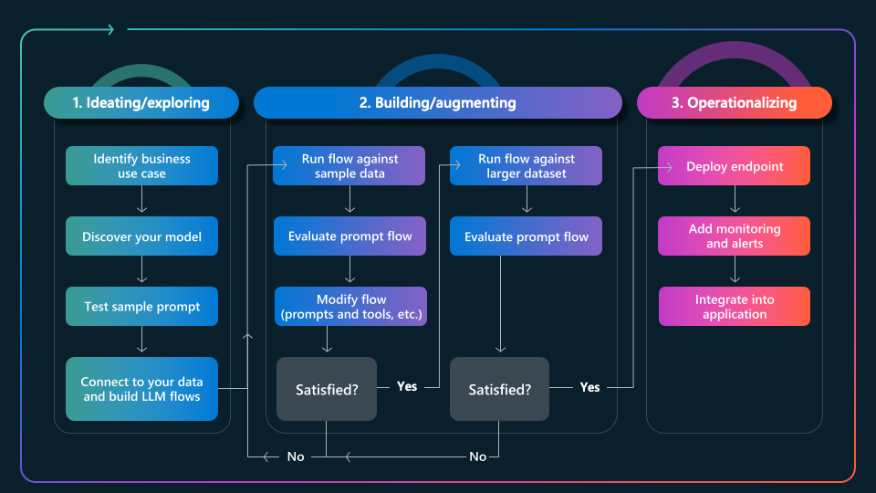

# 1.2 Application Lifecycle

## 1. Generative AI Operations 

When we think about the AI Engineer's journey from prompt to production, we also need to understand [the paradigm shifts in Generative AI Operations](https://techcommunity.microsoft.com/blog/aiplatformblog/the-future-of-ai-the-paradigm-shifts-in-generative-ai-operations/4254216) based on the following challenges faced by customers:

- **Complex Model Landscape** - how can I select the right model for my use case?
- **Data Quality & Quantity** - how can I discover or generate quality datasets for use?
- **Operational Performance** - how can I balance tokens, cost & performance optimization?
- **Security & Compliance** - how can I meet regulatory requirements & deliver trustworthy AI?

The result is a paradigm shift from traditional MLOps to LLMOps - and now **GenAIOps** - with focus on a _comprehensive set of practives, tools, foundation models, and frameworks_ to intergrate people, processes and platforms. The Azure AI platform offers a robust suite of tools and services to support this end-to-end developer journey, as shown below.

Let's look at how we can go from prompt to production using a **Portal-first** approach where we prioritize usage of tools and processes in the browser-based UI for a low-code experience.

---

## 2. E2E Development Worflow

To put the labs in context, let's look at the end-to-end application lifecycle from an AI Engineer perspective. The process can be broken into three stages: _ideation_ (prompt to prototype), _augmentation_ (prototype to production) and _operationalization_ (performance optimization). 

These stages map loosely onto GenAI Ops toolchains as follows:

1. **Ideation** = _Getting started_, _Customization_, _Prompt Management_ →  prompt to prototype.
- **Augmentation** = _Evaluation_ and _Orchestration_ →  prototype to production
- **Operationalization** - _Automation_ and _Monitoring_ → usage to optimization

In the **Hybrid** track we used the Azure AI Foundry portal for the initial setup but prioritized the SDK for development and production stages. In **this track** we'll instead look at each of the toolchains steps with a **Portal-first** approach.

## 3. Retail RAG scenario

While we can explore the development journey in abstract, it can help to have an application scenario to contextualize and frame the discussion. For convenience, let's repurpose the same application scenario used in the **Hybrid Track** (summarized below).

!!! quote "Some labs (e.g., Model Selection) may be general-purpose and not reflect this specific scenario."

_Assume that you are building the retail copilot chat AI (backend) that can be accessed from the Contoso Outdoor UI (frontend) shown below. Your chat AI needs to do the following:_

- Answer customer queries in natural language (= generative AI)
- Give answers grounded in product data (= RAG design pattern)
- Give answers that are **also** coherent, fluent & relevant (= evaluators)
- Block customer requests that have harmful intent (= content safety)
- Block customer requests that break the rules (= jailbreak protection)

- See: [Contoso Outdoor](./../../1-Hybrid-Workshop/1-Overview/01.md#2-contoso-outdoor-chat-ui) to understand the enterprise retail application scenario.
- See: [Application Data](./../../1-Hybrid-Workshop/1-Overview/02.md) to understand customer, product & manual data formats.

---