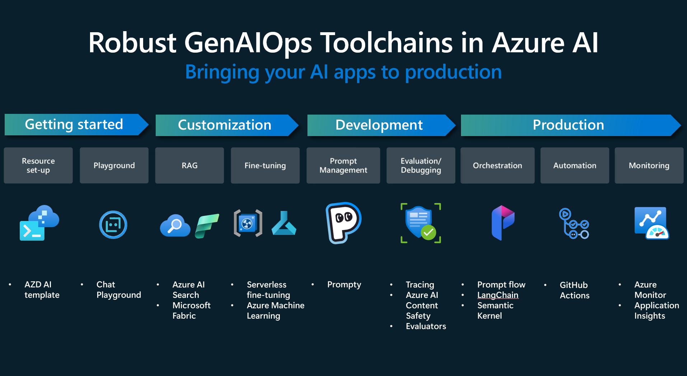

# 1.3 Azure AI Foundry Portal

In the previous section, we spoke broadly about the Generative AI Operations toolchains in Azure AI. In this section, we'll dive into more details about the **Azure AI Foundry** platform that streamlines this experience for AI Engineers and application developers.

Want to get a deeper dive into the details of the platform? Start with these two resources:

- [Azure AI Foundry Documentation](https://learn.microsoft.com/en-us/azure/ai-studio/) - canonical source.
- [Azure AI Foundry Documentation Markmap](https://markmap.js.org/full#?d=github%3Anitya%2Flearns-with-markmaps%40refs%3Aheads%2Fmain%2Fdocs%2Fazure-ai-foundry.mm.md) - interactive visualization

---

## 1. Azure AI Foundry Architecture

!!! info "Azure AI Foundry is the recommended platform for E2E development of _customizable_ gen AI apps on Azure"

1. The Azure AI Foundry platform provides _a unified experience_ for building, evaluating, and deploying, AI models and applications on Azure.

1. Developers can build applications end-to-end using the web portal (low-code), the SDK (code-first) or the CLI (code-agnostic) based on preferences.

1. The three main components to know are:

    - **Azure OpenAI Service** - specialized for use with OpenAI models.
    - **Azure AI Foundry Project** - richer model catalog, dev tools, security & access controls.
    - **Management Center** - for configuring AI hub, project, and connected, resources.

### 1.1 Azure OpenAI Resource

 Azure OpenAI Resource is the key to **working with OpenAI models.**

- Use it directly from Azure OpenAI Service or via an Azure AI Foundry project
- Connect directly (kind=`OpenAI`) or via AI Services (kind=`AIServices`) from project.

### 1.2 Azure AI Foundry Project 

Azure AI Foundry Project is key to **using full range of AI Foundry capabilities**  

- Explore 1800+ models (open-source, frontier, industry) through model catalog
- Connect to turnkey AI services (language, speech, document intellisense etc.)
- Connect to content safety services (filtering, jailbreak detection etc.)
- Connect to data & information retrieval services (AI Search, custom connections)
- Connect to storage & security services (key vault, log analytics etc.)

### 1.3 Management Center

??? info "FIGURE: View Management Center for an example Azure AI project _(click to expand)_"
    

The [Management Center](https://learn.microsoft.com/en-us/azure/ai-studio/concepts/management-center) provides a centralized location to manage governance and management tasks for your AI projects. To view the Management Center, visit the Azure AI project page and look for the _Management Center_ option on the sidebar (bottom, left). 

You can accomplish these tasks from this page:

1. [Manage hubs and projects](https://learn.microsoft.com/en-us/azure/ai-studio/concepts/management-center#manage-hubs-and-projects) - create & configure resource at both levels.
1. [Manage resource utilization](https://learn.microsoft.com/en-us/azure/ai-studio/concepts/management-center#manage-resource-utilization) - view and manage quota usage (with metrics)
1. [Manage access and governance](https://learn.microsoft.com/en-us/azure/ai-studio/concepts/management-center#govern-access) - add/remove users and assign/remove access roles.

---

## 2. Resource Types & Providers

An Azure resource provider is a set of REST operations that enable functionality for a specific Azure service. _Registering_ resource providers helps you define the Azure resources you can deploy to your account (subscription).

??? info "REVIEW: Learn about Azure & AI resource providers _(click to expand)_"

    A resource type's name follows the format: _{resource-provider}/{resource-type}_. 

    - Example: The resource type for a key vault is `Microsoft.KeyVault/vaults`.
    - Learn More: [Azure resource providers and types](https://learn.microsoft.com/en-us/azure/azure-resource-manager/management/resource-providers-and-types)
    - Learn More: [Azure AI Foundry resource providers and types](https://learn.microsoft.com/en-us/azure/ai-studio/concepts/architecture#azure-resource-types-and-providers)

### 1.2.3.1 AI Resource Providers
The Azure AI Foundry is built on the Azure Machine Learning resource provider, and takes a dependency on several other Azure services. 

??? info "REVIEW: list of _required_ resource providers for Azure AI.  _(expand to view)_"

    1. `Microsoft.MachineLearningServices/workspace (kind=hub)` - for hub
    1. `Microsoft.MachineLearningServices/workspace (kind=project)` - for project
    1. `Microsoft.CognitiveServices/account (kind=AIServices)` - for AI services
    1. `Microsoft.CognitiveServices/account (kind=AIServices OR OpenAI)` - for AOAI Service
    1. `Microsoft.Storage/storageAccounts` - for storing artifacts
    1. `Microsoft.KeyVault/vaults` - for storing secrets

??? info "REVIEW: list of _additional_ resource providers useful for RAG.  _(click to expand)_"

    1. `Microsoft.Search/searchServices` - for search & retrieval
    1. `Microsoft.ContainerRegistry/registries` - for registering docker images
    1. `Microsoft.Insights/components` -  for app insights & log analytics
    1. `Microsoft.OperationalInsights/workspaces` - for app insights & log analytics

### 1.2.3.2 Registering Providers

Some resource providers are registered by default. Others get registered on specific actions (e.g., deploy azd template with providers defined). Others need to be registered manually. **You can view and update provider registrations** using the Azure Portal or the Azure CLI.

Review these links to accomplish these tasks using the Azure Portal (in browser).

- [View resource provider details](https://learn.microsoft.com/en-us/azure/azure-resource-manager/management/resource-providers-and-types#view-resource-provider) - learn what each provider above does
- [Register resource provider](https://learn.microsoft.com/en-us/azure/azure-resource-manager/management/resource-providers-and-types#register-resource-provider-1) - check registration status & register it (if needed)
- [Troubleshoot provider errors](https://learn.microsoft.com/en-us/azure/azure-resource-manager/troubleshooting/error-register-resource-provider?tabs=azure-portal) - debug causes of common registration errors

---

## 1.2.4 Project & Hub Resources

[Hubs and projects](https://learn.microsoft.com/azure/ai-studio/concepts/ai-resources) are the key to building AI solutions end-to-end on Azure AI Foundry, using its full spectrum of models, tools, and connected resources.

1. The Azure AI Foundry `hub` is the top-level resource for managing projects - _for admins_.
1. The Azure AI Foundry `project` is the top-level resource for building apps - _for developers_.
1. The hub creates & configures connected resources - which projects then use seamlessly.
1. Every project **must** have a parent hub. Every hub **may** have one or more child projects.
1. Hubs are **collaboration** environments (team). Projects are **development** environments (app).

??? info "FIGURE: Understand how AI hub, project, and services, resources interact _(click to expand)_"
    

---

---

## 1.2.6 Portals On Azure

Throughout these workshops, you may hear the term "portal" used in different contexts. Broadly speaking, "portal" refers to a UI-based experience typically via the web browser. We will come across three different portal experiences when building AI applications on Azure.

1. [Azure AI Foundry Portal](https://learn.microsoft.com/en-us/ai/ai-studio-experiences-overview#is-azure-ai-foundry-portal-right-for-you) is for developers. Build generative AI Applications.
1. [Azure Machine Learning Studio](https://learn.microsoft.com/en-us/ai/ai-studio-experiences-overview#is-azure-machine-learning-studio-right-for-you) is for ML Engineers and Data Scientists. Build AI models.
1. [Azure Portal](https://learn.microsoft.com/en-us/azure/azure-portal/azure-portal-overview) is for IT Professionals and Admininstrators. Manage infrastructure.