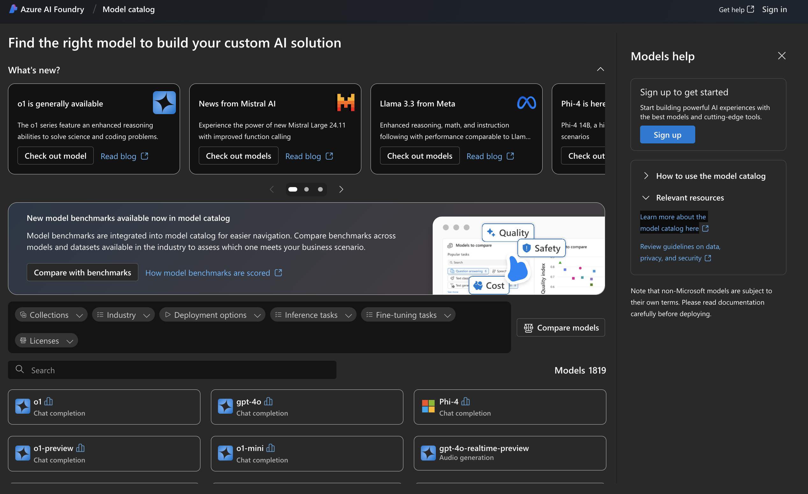

# 2. Model Catalog

The Azure AI Foundry model catalog is the starting point for model selection. It currently has 1800+ frontier, industry, and open-source, models that can be filtered by collection, industy, deployment option, inference task, and license. You can also take advantage of the built-in search capability to find models by name or other criteria. Let's explore this.

Start by opening a new private browser in guest mode and navigating to the [Azure AI Model catalog](https://ai.azure.com/explore/models) page in Azure AI Foundry. You should see this: 

??? info "FIGURE: click to expand for example screenshot. **Note model count** (ex: 1819 models)"
    

---

## 2.1 Filter By Inference Task

The first step is to see if the catalog has _any_ models that will fit your specific needs. Typically, this will involve knowing the **inference task** you want to perform, and **filtering** the catalog to see matching options. Inference tasks can fall under various categories like:

- natural language processing (e.g., text generation, question answering),
- computer vision (e.g., image classification, image segmentation)
- audio (text-to-speech, audio generation) 
- multimodal (visual question answering, document question answering) etc.

!!! task "Filter the catalog by a specific inference task to see matching models"

1. Filter by [Text generation](https://ai.azure.com/explore/models?selectedTask=text-generation) → see: 375+ models
1. Filter by [Embeddings](https://ai.azure.com/explore/models?selectedTask=embeddings) → see: 11+ models
1. Filter by [Chat completion](https://ai.azure.com/explore/models?selectedTask=chat-completion) → see: 62+ models

---

## 2.2 Filter By Deployment Type

Now let's look at the first filter (text generation) - this gives us 375+ results that match. How can we filter this down further? One way is to filter by deployment options. 

- [Managed compute](https://learn.microsoft.com/en-us/azure/ai-studio/how-to/deploy-models-managed) - provides a managed online endpoint (API) in a provisioned VM.
- [Serverless API](https://learn.microsoft.com/en-us/azure/machine-learning/how-to-deploy-models-serverless?view=azureml-api-2&tabs=azure-studio) - provide pay-as-you-go billing and a models-as-a-service (MaaS) approach.

The serverless API option can be more cost-effective and does not consume your model quota while still providing enterprise security and compliance guarantees. Let's try this out:

!!! task "Filter the catalog by a inference task & deployment type to see matching models"

1. First, Filter by [Text generation](https://ai.azure.com/explore/models?selectedTask=text-generation) → see: 375+ models
1. Then, Filter By [Serverless API](https://ai.azure.com/explore/models?selectedTask=text-generation&selectedDeploymentTypes=serverless-inference) deployment → see: 3 models (manageable subset)

---

## 2.3 Filter By Collection Type

Another way to filter models is by _collection_. At a high level, there are 3 key collections:

- [Curated by AI](https://ai.azure.com/explore/models?selectedCollection=-curated-by-azure-ai-,aoai,phi,meta,mistral,nvidia,ai21,deci,nixtla,core42,cohere,databricks,snowflake,sdaia,paige,bria,nttdata,saifr,rockwell,bayer,cerence,sightmachine) - frontier models that have been scanned for vulnerabilities.
- [Hugging Face](https://ai.azure.com/explore/models?selectedCollection=huggingface) - open-source model variants from the community
- [Benchmark Results](https://ai.azure.com/explore/models?selectedCollection=-benchmark-results-) - models that we can compare benchmarks on

You can also select a specific model provider in the collections filter, to see only models from that provider. This is a particularly useful filter to use if you want to prioritize using an **open-source** model, or want to pick models that you can compare benchmarks on. Let's try it.

!!! task "Filter the catalog by inference task and benchmark results collection to see matching models"

1. First, Filter by [Text generation](https://ai.azure.com/explore/models?selectedTask=text-generation) → see: 375+ models
1. Then, Filter By [Benchmark Results](https://ai.azure.com/explore/models?selectedTask=text-generation&selectedCollection=-benchmark-results-) collection → see: 22 models (that I can compare)
1. OR Filter by [Hugging Face](https://ai.azure.com/explore/models?selectedTask=text-generation&selectedCollection=huggingface) → see: 322 models (that are open-source)

---

## 2.4 Filter By Industry Domain

Last but not least, we now have a specialized filter for Industry, allowing you to select models that have been specifically curated and tailored for use in vertical domains like Health and Life Sciences, Financial Services etc. Because these are industry-specific, they can be more effective as the _first_ filter for discovery. Let's try it.
 

!!! task "Filter the catalog by a industry to see matching models"

1. Filter by [Financial Services](https://ai.azure.com/explore/models?selectedIndustryFilter=financial-services) → see: 10 models _including Saifr_ → Clear results
1. First,Filter by [Health & Life Sciences Industry](https://ai.azure.com/explore/models?selectedIndustryFilter=health-and-life-sciences) → see: 20 models 
1. Then, Filter by [Embeddings Inference Task](https://ai.azure.com/explore/models?selectedIndustryFilter=health-and-life-sciences,financial-services) → see: 2 models 

---

## 2.5 Filter By Fine-Tuning Task

Model selection is typically followed by model **customization** - using prompt engineering, retrieval augmented generation, or fine-tuning - to improve the model response to suit your application quality and safety criteria. [Fine-tuning](https://learn.microsoft.com/en-us/azure/ai-studio/concepts/fine-tuning-overview) works by performing _additional training_ on an existing pre-trained model using a relevant new dataset to enhacne performance or add new skills.

Currently only a subset of models in the catalog can be fine-tuned, and these may have [added constraints](https://learn.microsoft.com/en-us/azure/ai-studio/concepts/fine-tuning-overview#supported-models-for-fine-tuning) like regional availability for fine-tuning. Let's see how this works.

!!! task "Filter the catalog by for a fine-tuning model for text generation"

1. Filter by [Text generation for INFERENCE](https://ai.azure.com/explore/models?selectedTask=text-generation) → see: 375+ models → Clear results
1. Filter by [Text generation for FINE-TUNING](https://ai.azure.com/explore/models?selectedFineTuningTask=text-generation) → see: 14 models
1. Then, Filter by [Serverless API Deployment](https://ai.azure.com/explore/models?selectedFineTuningTask=text-generation&selectedDeploymentTypes=serverless-inference) → see: 3 models (Llama-2)

---

## 2.6 Search By Keyword

Sometimes, the predefined filters are not sufficient to reduce the model subset to a manageable level for manual evaluation. This can be for various reasons:

1. You want to see if the catalog _has a specific model name_.
1. The model inference task _may not be a standard option_.
1. You want to see if there are models _with a specific capability_.

!!! task "Example 1 (Taxonomy mismatch) - search by category name" 

1. First, look for [Embeddings](https://ai.azure.com/explore/models?selectedTask=embeddings) inference task. → see: 10 models (no Hugging Face)
1. Now, search for "Sentence Similarity" ([HF taxonomy](https://huggingface.co/tasks/sentence-similarity)) → see: 7 open-source models 

!!! task "Example 2 (Known entity) - search by name" 

1. Search for "smol"  → see: 1 model = flagship SLM from Hugging Face 
1. Search for "unsloth"  → see: 2 models = from specific community creator

!!! task "Example 3 (Other keywords) - search by capability" 

1. Search for "sql"  → see: 2 models = create sql queries using natural language
1. Search for "biomed" → see: models = focus on biomedical applications & data

