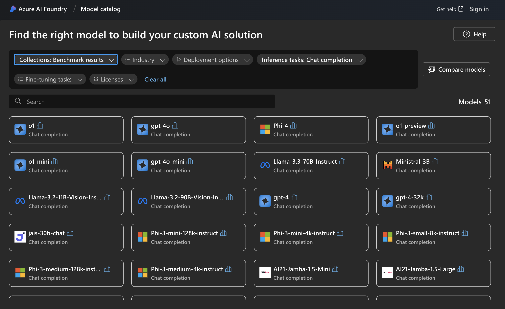
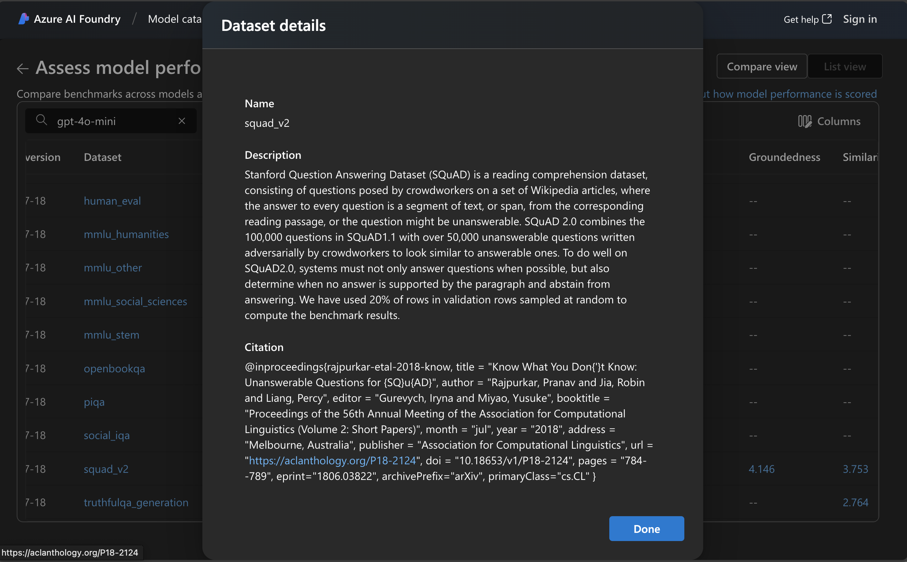

# 3. Model Benchmarks

## 3.1 Filter By Benchmarks

For RAG architectures, we need a _chat completion_ model and an _embedding_ model. To select a model for prototyping, we'll filter by inference task, then look for models with benchmarks, then compare a few by available metrics to make a decision. **Let's find our chat model**:

1. Filter by [Chat Completion](https://ai.azure.com/explore/models?selectedTask=chat-completion) → see: 62 models 
1. Now, Filter by [Benchmark Results](https://ai.azure.com/explore/models?selectedTask=chat-completion&selectedCollection=-benchmark-results-) → see: 51 models 
1. You should see something like this:

    ??? info "FIGURE: click to expand for example screenshot"
        

1. Click **Compare Models** → see: [Assess model performance with evaluated metrics](https://ai.azure.com/explore/models/benchmarks) 

Let's use this page to compare the model options by available benchmarks.

---

## 3.2 Compare By Benchmarks

In the previous step, we saw 51 choices that included the 4 models below. 

- _gpt-4o, gpt-4o-mini, AI21-Jamba-1.5-Mini, and Phi-3-mini-128k-instruct_.

Let's use these as a sample for an exercise in using benchmarks for model selection.

1. The [Benchmarks Compare View](https://ai.azure.com/explore/models/benchmarks) will have default models selected. **Delete the defaults.**
1. Now, add the 4 models above (one at a time) using the `+ Model to compare` button.
1. You should see something like this:

    ??? info "FIGURE: click to expand for example screenshot"
        

1. Explore the available critera for comparisons (click each drop-down in the chart)
    - Criteria include: _quality_, _embeddings_, _cost_ and _latency_. 
1. Select _Accuracy_ for x-axis and _Cost_ for y-axis as shown in figure above
    - The chart will update to show where models fit on this comparison
    - Higher accuracy values - and lower cost values - are better.
1. Observe the chart. We can see:
    - the `AI21-Jamba-1.5-Mini` model costs the least but is also the least accurate
    - the `gpt-4o` model has the highest accuracy but also the highest cost.
    - the `gpt-4o-mini` has comparable cost to (1) and is second in accuracy to (2).
1. Make an informed decision: select `gpt-4o-mini` 
    - we'll review the Model card in the next section to determine next steps.

!!! task "HOMEWORK: Walk through a similar process to select an **embedding** model."

---

## 3.3 List By Benchmarks

The compare view above lets you assess model choices relative to each other based on specific criteria like accuracy, cost and other metrics. The **list view** provides more detailed metrics for each model, giving insights into their effectiveness for various tasks. Learn more:

1. [Benchmarking of LLMs and SLMs](https://learn.microsoft.com/en-us/azure/ai-studio/concepts/model-benchmarks#benchmarking-of-llms-and-slms).

1. [Benchmarking of embedding models](https://learn.microsoft.com/en-us/azure/ai-studio/concepts/model-benchmarks#benchmarking-of-embedding-models).

Let's explore this briefly for the `gpt-4o-mini` model we selected earlier.

1. Search for the model by name as shown below. You should see:
    - A row of benchmarks for that model, each with a model version and associated dataset
    - Each row has columns for relevant quality metrics (with values, where assessed)
    - The top row provides the _average_ for each metric, across all assessed benchmark
    ??? info "FIGURE: click to expand for example screenshot"
        

1. We see this model ranks well on accuracy and prompt-based metrics like coherence, fluency, and groundedness - but does less well on GPTSimilarity. See: [Quality docs](https://learn.microsoft.com/en-us/azure/ai-studio/concepts/model-benchmarks#quality) for explainers on what each metric means. _Overall, we see the selected model quality is acceptable_.
1. Each row of benchmarks for a model defines a _dataset_ and a _task_. The dataset contains examples of inputs relevant to the task, along with information to assess quality of model response to that input. The resulting quality metrics are listed in that row. Click on a dataset to get more details on what it does, and how.

    - Ex 1: Click `human_eval` which assesses _accuracy_ for Text generation tasks
        - it assesses functional correctness of _code generation_ from given word problem.
        - it assesses this model at 0.841 accuracy for this text generation task.

        ??? info "FIGURE: (click to expand) Dataset details for `HumanEval`"
            

    - Ex 2: Click `squad_v2` which assesses _groundedness_ and _relevance_ for QA tasks
        - it assesses _reading comprehension_ using questions on a Wikipedia dataset.
        - it assesses this model at 4.146 for Groundedness and 3.753 for GPTSimilarity.

        ??? info "FIGURE: (click to expand_ Dataset details for `squad_v2`"
            

This allows us to get a quick sense of the _general suitability_ of the selected model based on benchmarks. The next step, is to explore the model card.

---
