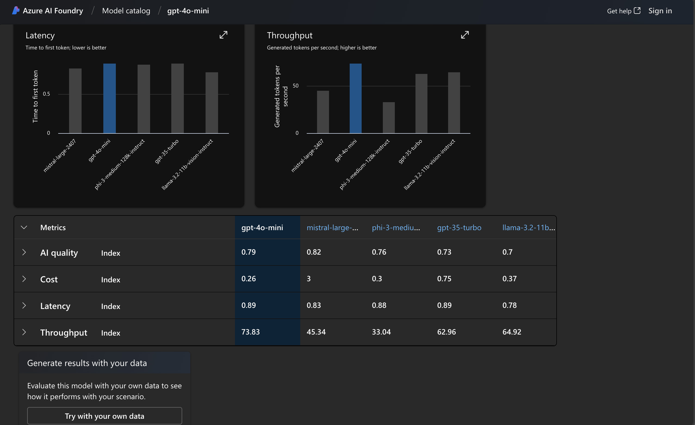

# 4. Model Card

The model card for a selected model provides all the necessary information to help you understand its capabilities, pricing, quality and more. And, it provides the starting point for **deploying** the model to explore it interactively.

## 4.1 Overview

1. Click the [gpt-4o-mini](https://ai.azure.com/explore/models/gpt-4o-mini/version/2024-07-18/registry/azure-openai) result to navigate to the model card in Azure.

    -  You should see this - note the links to pricing and estimated cost.

        ??? info "FIGURE: (click to expand) Model Card Overview (Details tab - top)"
            

    - Scroll down. You see model provider details on tasks and benchmarks of relevance.

        ??? info "FIGURE: (click to expand) Model Card Overview (Details tab - bottom)"
            

## 4.2 Benchmarks

1. Click the `Benchmarks` tab in the model card. 
    
    - The top half of the page provides this view. Clicking [Compare with other models](https://ai.azure.com/explore/models/benchmarks?modelId=gpt-4o-mini) takes you to the Benchmarks view from earlier, but with this model as main focus (and other example models for comparison).

        ??? info "FIGURE: (click to expand) Benchmarks tab - compare other models"
            

    - Scroll down. You should see options to try evaluating the model with your own data.

        ??? info "FIGURE: (click to expand) Benchmarks tab - try with your own data"
            

## 4.3 Deployment

1. Click the `Code samples` tab in the model card. You should see code snippets for using this model _programmatically_ with the Azure AI Inference SDK, for various languages. **But what if you want to explore this model in a playground in the portal?**
    
    ??? info "FIGURE: (click to expand) Code Samples tab - pick your language"
        

1. Click the `Details` tab to get back to the overview (guest mode). Note the `Create a subscription to deploy` button indicating we need to log into Azure before we can proceed. Let's do that next.

    ??? info "FIGURE: (click to expand) Model Card Overview (Guest Mode)"
        

1. Logging in gives us a `Deploy` button as shown. Clicking that now gives you the choice of deploying the model to an _existing_ project, or _creating a new project_ for this purpose.

    ??? info "FIGURE: (click to expand) Model Card Overview (Authenticated)"
        

In the [next lab](./../02-Model-Exploration/01.md) we'll continue from this point to explore Project setup and model deployment. But first, a quick note on data, privacy, and security considerations when working with models in the Azure AI model catalog.

